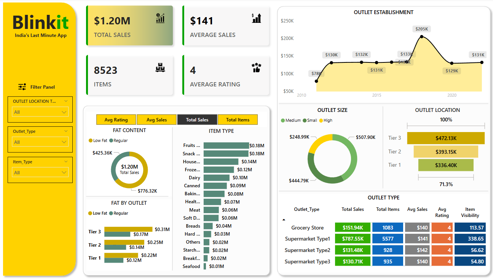

# 🛒 Blinkit Sales Analysis using SQL, Python & Power BI

This project analyzes sales data from Blinkit (a grocery delivery platform) using **MySQL**, **Python (Pandas)**, and **Power BI**. It extracts insights like total revenue, item-level performance, and outlet-wise trends, while showcasing real-world data cleaning, visualization, and analytics workflows.

---

## 📊 Project Overview

**Objective:**  
To clean, transform, visualize, and analyze Blinkit sales data to generate meaningful business insights using SQL, Python, and Power BI.

**Key Areas Covered:**
- Data Cleaning (SQL + Pandas)
- KPIs (Total Sales, Average Rating, etc.)
- Sales Breakdown (by Item Type, Fat Content, Outlet Type)
- Views for real-time analytics

---

## 🧰 Tech Stack

- **SQL (MySQL)** – Data querying, cleaning, KPI reporting  
- **Python (Pandas)** – Data preprocessing before import  
- **Power BI** – Interactive dashboards and visual insights  
- **GitHub** – Version control and project sharing

---

## ⚙️ Setup Notes
> The initial schema was generated using MySQL's **Table Data Import Wizard** from CSV files.  
> After import, **data types were cleaned and adjusted**, and **null values were handled** by [null_fix.ipynb](./preprocessing/null_fix.ipynb) (located in the `preprocessing/` folder).  
> Additional data cleaning was performed via SQL script by [01_data_cleaning_sql](./preprocessing/01_data_cleaning_sql) (located in the `/scripts/` folder).

---

## 🌟 Highlights

- 🚀 Cleaned and transformed real-world sales data using SQL & Python  
- 📊 Built reusable views for efficient reporting  
- 📈 Delivered visual insights via Power BI dashboard
---

## 📈 Sample Insights

- 🧈 **Regular fat** items generate more sales than **low-fat**  
- 🏬 **Medium-sized outlets** outperform small and high-end ones  
- ⭐ **Dairy and snack foods** have the highest average ratings  
- 📍 **Urban locations** dominate overall sales share  

📄 [Click here to view the full insights summary](./output/insights_summary.md)

---

## 📊 Power BI Dashboard & Presentation

The sales insights were visualized using **Power BI** to create an interactive dashboard, highlighting trends across item types, outlet sizes, fat content, and urban vs rural sales distribution.

🖥️ **Dashboard Includes:**
- Total Sales, Ratings, and Volume KPIs  
- Sales comparison by Item Type & Fat Content  
- Outlet Type performance across regions  
- Location-wise sales breakdown

📸 *Preview:*  

🎤 **Presentation:**  
A walkthrough presentation explaining the insights, methodology, and business takeaways is available in the `visuals/` folder.  
📄 [Click here to view the full presentation walkthrough](./visuals//Blinkit_Sales_Dashboard.pbix)

---
